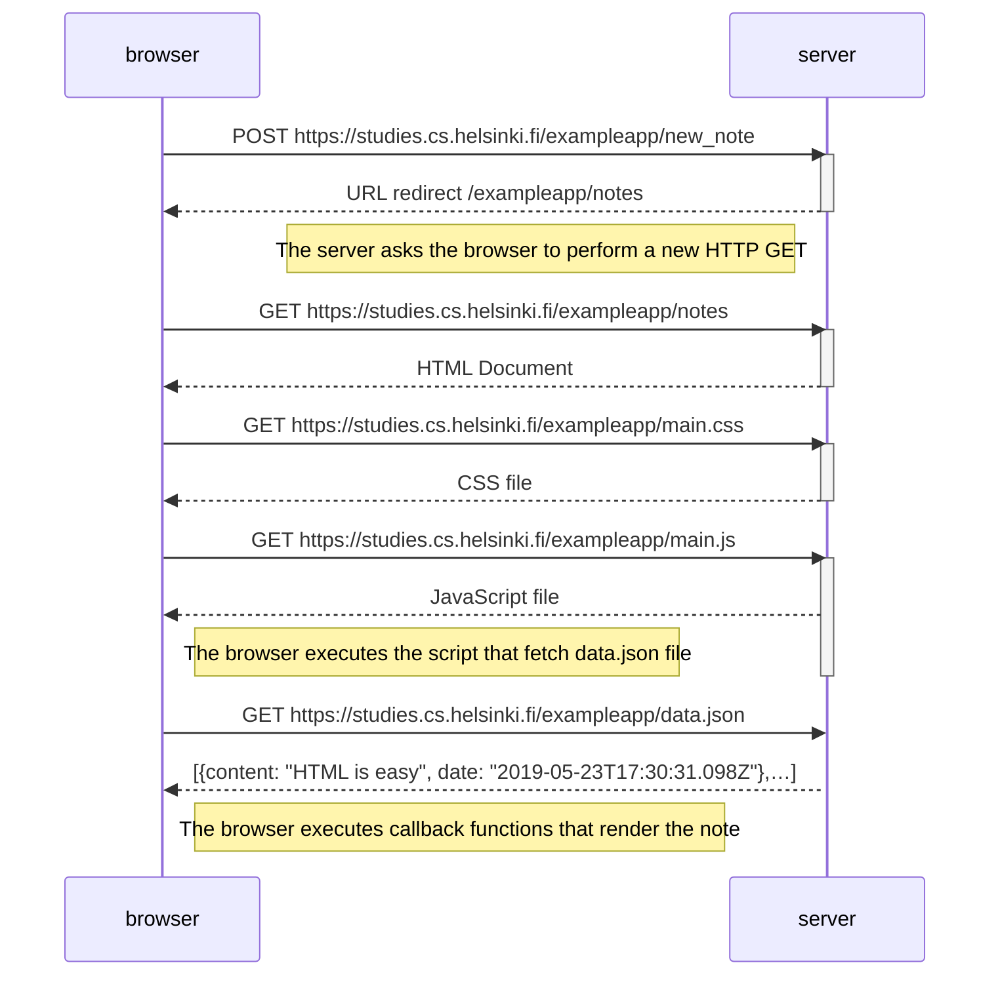

```mermaid
sequenceDiagram
participant browser
participant server

browser->>server: POST https://studies.cs.helsinki.fi/exampleapp/new_note
activate server
server-->>browser: URL redirect /exampleapp/notes
deactivate server
Note left of server: The server asks the browser to perform a new HTTP GET

browser->>server: GET https://studies.cs.helsinki.fi/exampleapp/notes
activate server
server-->>browser: HTML Document
deactivate server

browser->>server: GET https://studies.cs.helsinki.fi/exampleapp/main.css
activate server
server-->>browser: CSS file
deactivate server

browser->>server: GET https://studies.cs.helsinki.fi/exampleapp/main.js
activate server
server-->>browser: JavaScript file
Note right of browser: The browser executes the script that fetch data.json file
deactivate server

browser->>server: GET https://studies.cs.helsinki.fi/exampleapp/data.json
activate server
server-->>browser: [{content: "HTML is easy", date: "2019-05-23T17:30:31.098Z"},…]
Note right of browser: The browser executes callback functions that render the note
```
